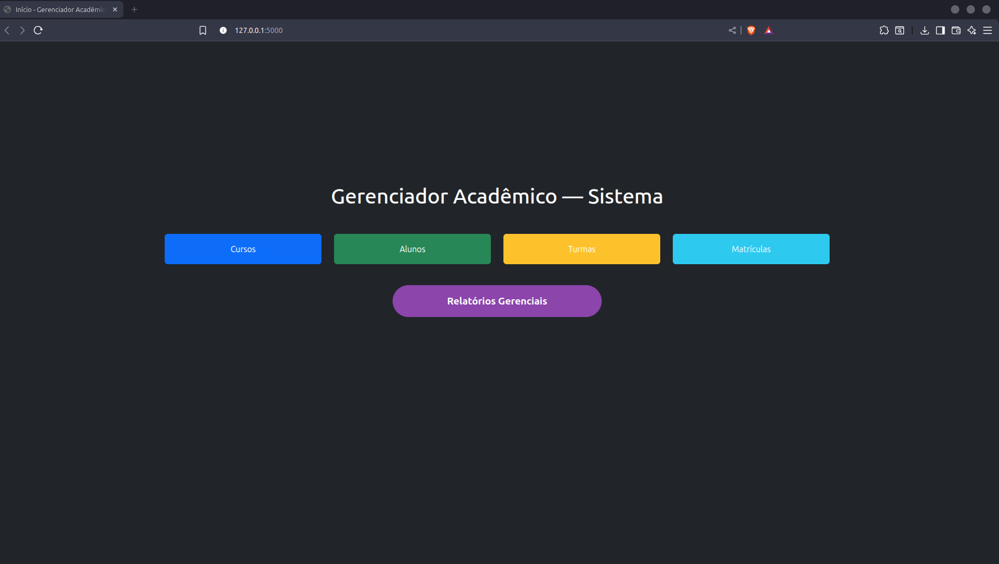
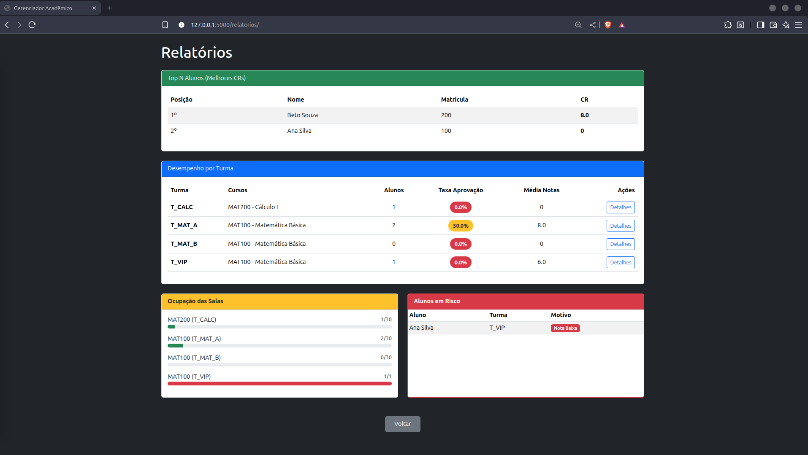
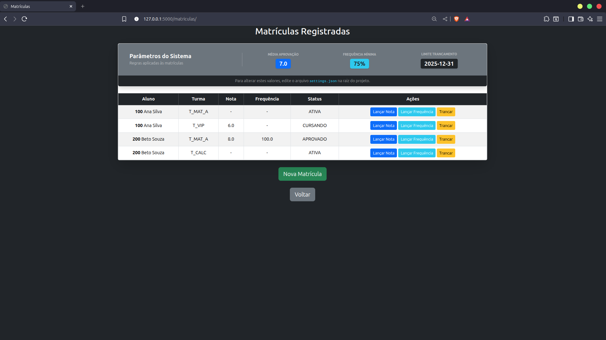
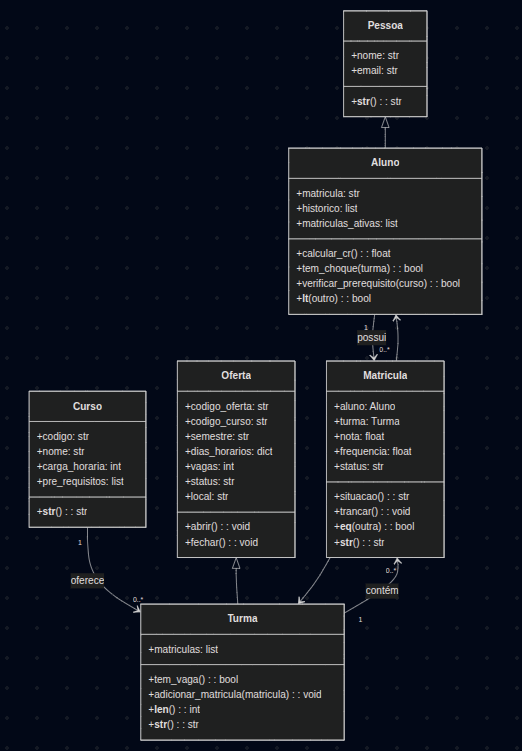

# Projeto 1 — Programação Orientada a Objetos

### Tema 6 — Gerenciador de Cursos e Alunos

## 👨‍💻 Autor

| Nome                         | GitHub           |
| ---------------------------- | ---------------- |
| Leôncio Ferreira Flores Neto | [@LeoncioFerreira](https://github.com/LeoncioFerreira)|

---

# 📌 Descrição do Projeto

Este projeto implementa um **Gerenciador de Cursos e Alunos**, conforme o Tema 6 da disciplina de **Programação Orientada a Objetos (UFCA)**.

O sistema contempla:
* Cursos e pré-requisitos
* Ofertas de disciplinas (turmas) com horários, vagas e status
* Alunos e histórico acadêmico
* Matrículas com validações de pré-requisitos, vagas e choque de horário
* Lançamento de notas e frequência
* Cálculo de situação acadêmica
* Relatórios gerais (taxa de aprovação, top N alunos, etc.)
---
## 📸 Screenshots da Aplicação

A seguir estão algumas telas da aplicação em execução,
destacando a navegação principal, regras acadêmicas
e relatórios gerenciais.

### Dashboard Principal


### Relatórios Acadêmicos


### Gestão de Matrículas

---

## 🎯 Status do Desenvolvimento

**Entrega Final — Semana 5 (Concluída)**  

O projeto encontra-se **totalmente implementado**, atendendo aos requisitos funcionais e técnicos definidos no **Tema 6** da disciplina de Programação Orientada a Objetos.

---

## 🧠 Conceitos de Programação Orientada a Objetos Aplicados

### ✔ Herança
- `Pessoa → Aluno`
- `Oferta → Turma`

### ✔ Encapsulamento
- Uso extensivo de `@property` para validação de:
  - Nota (0–10)
  - Frequência (0–100)
  - Vagas (≥ 0)
  - Status (`ABERTA` / `FECHADA`)
  - CR ≥ 0

### ✔ Métodos Especiais
- `Aluno.__lt__` → ordenação por CR  
- `Turma.__len__` → ocupação da turma  
- `Curso.__str__`  
- `Matricula.__eq__`  
- `__str__` em múltiplas entidades  

---
## 🧪 Testes Automatizados

O projeto possui **testes automatizados com pytest**, cobrindo:

- Criação e validação de **Aluno**, **Curso**, **Turma** e **Matrícula**
- Regras de matrícula:
  - Pré-requisito não atendido
  - Choque de horário
  - Turma lotada
  - Turma fechada
- Cálculo de CR
- Situação acadêmica:
  - APROVADO
  - REPROVADO_POR_NOTA
  - REPROVADO_POR_FREQUENCIA
  - CURSANDO
- Relatórios acadêmicos
- Persistência em JSON

➡️ Total de testes: **≥ 15**, conforme exigido no pdf.

---

## 🧩 UML Textual

### Classe: Pessoa
- `nome`
- `email`
- `__str__()`

### Classe: Aluno (Pessoa)
- `matricula`
- `historico`
- `matriculas_ativas`
- `calcular_cr()`
- `tem_choque()`
- `__lt__()`

### Classe: Curso
- `codigo`
- `nome`
- `carga_horaria`
- `pre_requisitos`
- `__str__()`

### Classe: Oferta
- `codigo_oferta`
- `codigo_curso`
- `semestre`
- `dias_horarios`
- `vagas`
- `status`
- `local`
- `abrir()`
- `fechar()`

### Classe: Turma (Oferta)
- `curso (associação)`
- `matriculas`
- `tem_vaga()`
- `__len__()`
- `__str__()`

### Classe: Matricula
- `aluno`
- `turma`
- `nota`
- `frequencia`
- `status`
- `situacao()`
- `trancar()`
- `__eq__()`
- `__str__()`

### Classe: Configuracoes
- `nota_minima_aprovacao`
- `frequencia_minima`
- `data_limite_trancamento`
- `max_turmas_por_aluno`
- `top_n_alunos`

---
## 📐 Diagrama de Classes (UML)

O diagrama abaixo ilustra a estrutura das classes, demonstrando a aplicação de **Herança** (Pessoa/Aluno, Oferta/Turma) e as relações de **Associação** entre as entidades acadêmicas.


> Observação: A classe `Configuracoes` representa regras de infraestrutura e foi documentada textualmente, não sendo incluída no diagrama visual para manter o foco no domínio acadêmico principal.
---
# 🔗 Tabela Resumida de Relacionamentos

| Classe Origem | Tipo de Relação | Classe Destino  | Descrição |
|---------------|------------------|------------------|-----------|
| Pessoa        | Superclasse      | Aluno            | Aluno herda nome, email e validações de Pessoa |
| Curso         | 1:N              | Turma            | Um curso pode ter várias turmas ofertadas |
| Oferta        | Superclasse      | Turma            | Turma é uma especialização da classe Oferta |
| Aluno         | 1:N              | Matricula        | Um aluno possui várias matrículas (ativas e no histórico) |
| Turma         | 1:N              | Matricula        | Uma turma possui várias matrículas dos alunos inscritos |
| Matricula     | Associação       | Aluno ↔ Turma    | Matrícula conecta aluno e turma de forma bidirecional |
| Configuracoes | Dependência      | Matricula        | Matrícula usa regras acadêmicas definidas em Configuracoes |

---

# 📁 Estrutura do projeto

```
Gerenciador-de-Cursos-e-Alunos/
│
├── data/                         # Arquivos de persistência em JSON
│   ├── alunos.json               # Dados dos alunos cadastrados
│   ├── cursos.json               # Catálogo de cursos
│   ├── matriculas.json           # Matrículas (Aluno ↔ Turma)
│   ├── turmas.json               # Turmas/ofertas de disciplinas
│   └── settings.json             # Configurações acadêmicas do sistema
│
├── routes/                       # Rotas Flask (camada de interface)
│   ├── alunos_routes.py          # Rotas de CRUD de alunos
│   ├── cursos_routes.py          # Rotas de CRUD de cursos
│   ├── matriculas_routes.py      # Rotas de matrícula, nota e frequência
│   ├── relatorios_routes.py      # Rotas de relatórios acadêmicos
│   └── turmas_routes.py          # Rotas de CRUD de turmas
|
├── screenshots/                  # Imagens da aplicação (README)
│   ├── dashboard.png             # Tela inicial / Dashboard
│   ├── diagrama_classes.png      # Diagrama de classes UML
│   ├── matriculas.png            # Tela de gestão de matrículas
│   └── relatorios.png            # Tela de relatórios acadêmicos
│
├── src/                          # Núcleo da aplicação
│   ├── infra/                    # Camada de infraestrutura
│   │   ├── configuracoes.py      # Leitura e acesso ao settings.json
│   │   ├── persistencia.py       # Funções de salvar/carregar JSON
│   │   └── __init__.py
│   │
│   ├── models/                   # Entidades do domínio (POO)
│   │   ├── aluno.py              # Classe Aluno (herda de Pessoa)
│   │   ├── curso.py              # Classe Curso
│   │   ├── matricula.py          # Classe Matricula (Aluno ↔ Turma)
│   │   ├── oferta.py             # Classe base Oferta
│   │   ├── pessoa.py             # Classe base Pessoa
│   │   ├── turma.py              # Classe Turma (herda de Oferta)
│   │   └── __init__.py
│   │
│   ├── services/                 # Regras de negócio do sistema
│   │   ├── aluno_service.py      # Serviços relacionados a alunos
│   │   ├── curso_service.py      # Serviços relacionados a cursos
│   │   ├── matricula_service.py  # Serviços de matrícula, nota e frequência
│   │   ├── relatorio_service.py  # Serviços de relatórios acadêmicos
│   │   ├── sistema.py            # Coordenador central das regras de negócio
│   │   ├── turma_service.py      # Serviços relacionados a turmas
│   │   └── __init__.py
│   │
│   └── __init__.py
│
├── templates/                    # Templates HTML
│   ├── alunos/                   # Telas relacionadas a alunos
│   │   ├── alunos.html
│   │   ├── cad_aluno.html
│   │   └── editar_aluno.html
│   │
│   ├── cursos/                   # Telas relacionadas a cursos
│   │   ├── cursos.html
│   │   ├── cad_curso.html
│   │   └── editar_curso.html
│   │
│   ├── matriculas/               # Telas relacionadas a matrículas
│   │   ├── matriculas.html
│   │   ├── cad_matriculas.html
│   │   ├── lancar_frequencia.html
│   │   └── lancar_nota.html
│   │
│   ├── relatorios/               # Telas de relatórios acadêmicos
│   │   ├── detalhe_turma.html
│   │   └── relatorios.html
│   │
│   ├── turmas/                   # Telas relacionadas a turmas
│   │   ├── turmas.html
│   │   ├── cad_turma.html
│   │   └── editar_turma.html
│   │
│   ├── base.html                 # Template base da aplicação
│   ├── cad_padrao.html           # Layout padrão para formulários de cadastro
│   ├── edit_padrao.html          # Layout padrão para formulários de edição
│   ├── erro_padrao.html          # Tela padrão de erro
│   ├── tabela_padrao.html        # Layout padrão para tabelas
│   └── index.html                # Página inicial
│
├── static/                       # Arquivos estáticos
│   └── bootstrap.css             # Estilo CSS da aplicação
│
├── tests/                        # Testes automatizados (pytest)
│   ├── test_aluno.py             # Testes da classe Aluno
│   ├── test_curso.py             # Testes da classe Curso
│   ├── test_matricula.py         # Testes da classe Matricula
│   ├── test_persistencia.py      # Testes da camada de persistência
│   ├── test_sistema.py           # Testes das regras de negócio
│   └── test_turma.py             # Testes da classe Turma
│
├── app.py                        # Arquivo principal da aplicação Flask
├── pytest.ini                    # Configuração do pytest
├── requirements.txt              # Dependências do projeto
├── README.md                     # Documentação do projeto
├── .flaskenv                     # Variáveis de ambiente do Flask
└── LICENSE                       # Licença do projeto
```
---
## 🏗️ Arquitetura em Camadas

A organização dos diretórios do projeto foi planejada seguindo o modelo de arquitetura em camadas, promovendo separação de responsabilidades e melhor manutenção do código.
---
Interface: `routes/`, `templates/`, `static/`

Serviços (Regras de Negócio): `src/services/`

Domínio (Modelo): `src/models/`

Infraestrutura: `src/infra/`

Testes: `tests/`

---
## 🚀 Como Executar o Projeto

A seguir estão as instruções completas para instalar dependências, ativar ambiente virtual e executar os testes automatizados do projeto.
---
### 1️⃣ Clonar o repositório

```bash
git clone https://github.com/LeoncioFerreira/Gerenciador-de-Cursos-e-Alunos.git
cd Gerenciador-de-Cursos-e-Alunos
```
### 2️⃣ Criar ambiente virtual (Opcional, mas recomendado)

Isolar as dependências do projeto evita conflitos com outras bibliotecas instaladas no sistema.

**Linux/MacOS:**
```bash
python3 -m venv venv
source venv/bin/activate
```
***Windows:***

```PowerShell

python -m venv venv
venv\Scripts\activate
```
### 3️⃣ Instalar as dependências
O projeto utiliza o pytest. Certifique-se de que o arquivo requirements.txt esteja na raiz do projeto e execute:

```bash
pip install -r requirements.txt
```
### 4️⃣ Executar os testes automatizados
Para rodar todos os testes com saída detalhada:
```bash
pytest -v
```
Para parar no primeiro erro:
```bash
pytest --maxfail=1
```
### 5️⃣ Executar a aplicação Flask

Antes de iniciar a aplicação, certifique-se de que o ambiente virtual esteja ativado e que as dependências já tenham sido instaladas.
Iniciar o servidor Flask
```bash
flask run
```
Após a execução, a aplicação estará disponível em:
```bash
http://127.0.0.1:5000
